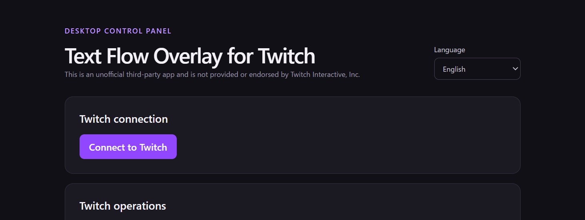
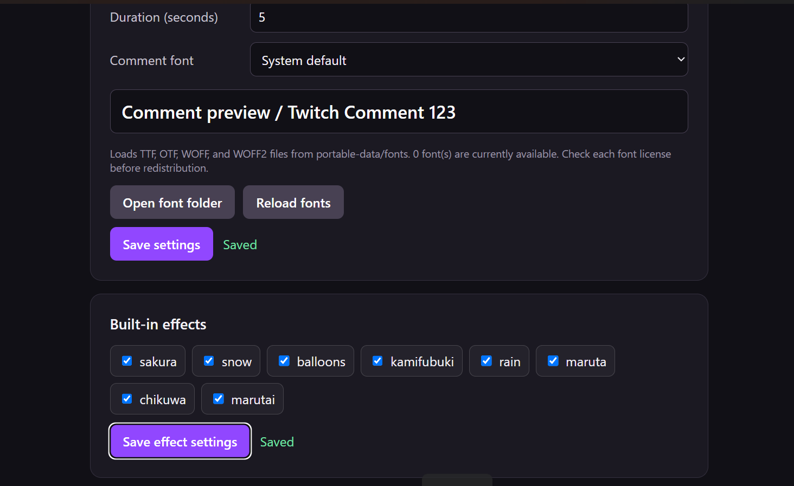
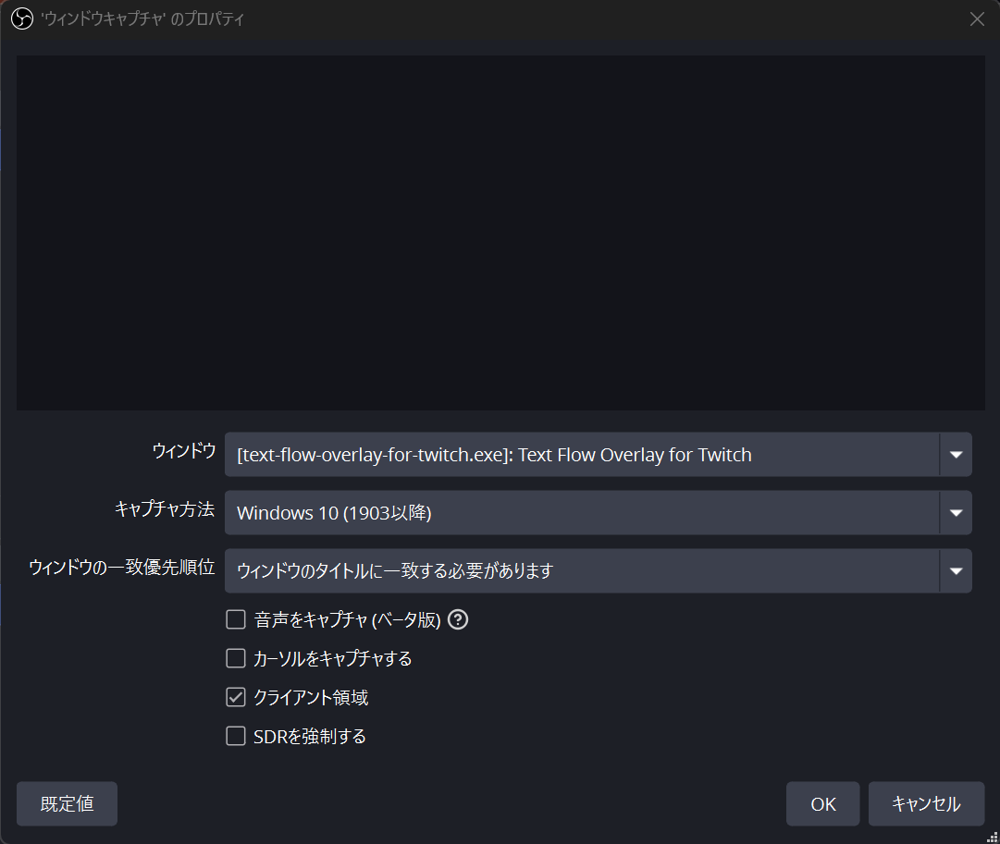
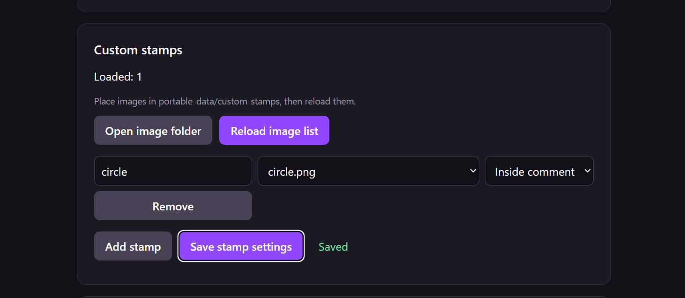
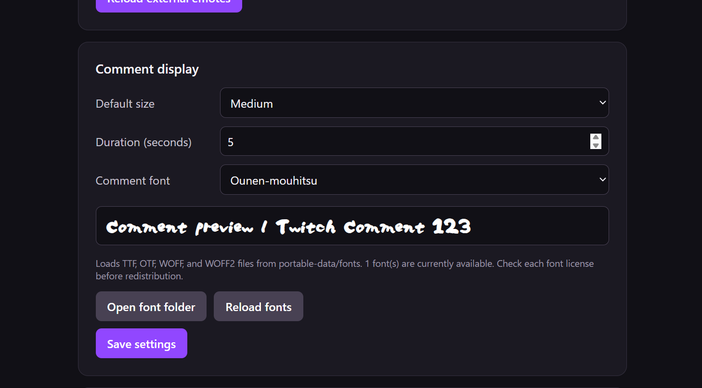

# Text Flow Overlay for Twitch

[日本語](README.md) | [English](README.en.md)

A Windows desktop application that displays Twitch chat messages, emotes, custom stamps, effects, and Raid introductions in OBS.

This is an unofficial third-party app and is not provided or endorsed by Twitch Interactive, Inc.

No Streamer.bot setup or installer is required. Extract the ZIP, launch the executable, and connect your Twitch account.



## Features

- Flow Twitch chat messages and emotes across the screen
- Display BTTV and 7TV emotes
- Show built-in effects such as cherry blossoms, snow, balloons, and confetti
- Register your own images as custom stamps
- Choose from standard fonts or add custom fonts
- Introduce raiders with their name, profile image, and clips
- Switch between automatic Raid introductions and per-raider manual clip/shoutout controls
- Send a shoutout to the raider
- Start commercials through the official Twitch API
- Open Creator Dashboard in a browser
- Record users who interact through chat, Bits, subscriptions, gifts, or Raids
- Switch the interface between Japanese and English
- Move the overlay offscreen without interrupting OBS capture
- Keep settings and custom assets beside the executable for portability

After connecting to Twitch once, your login is saved and the connection will normally be restored the next time the app starts.

## Requirements

- Windows 10 or Windows 11 (x64)
- Microsoft Edge WebView2 Runtime
- A Twitch account
- OBS Studio, when using the overlay in a stream

WebView2 Runtime is already installed on many Windows 10 and Windows 11 systems. If the app does not start, install the WebView2 Runtime provided by Microsoft.

## Using the portable build

1. Download `Text-Flow-Overlay-for-Twitch-*-windows-portable.zip` from GitHub Releases.
2. Extract the ZIP into a writable folder.
3. Run `Text Flow Overlay for Twitch.exe`.
4. Select **Connect to Twitch** in the control panel and complete authorization.
5. Configure and save the comment, effect, and Raid settings you need.
6. Add the overlay window to OBS.



On first launch, the app creates `portable-data` beside the executable. When updating, keep `portable-data` and replace the executable with the new version.

Only one app instance can run at a time. If you launch the executable again, the new process exits and brings the existing control panel to the foreground.

## Adding the overlay to OBS

1. Add a **Window Capture** source in OBS.
2. Select the `Text Flow Overlay for Twitch` window.
3. Adjust its transform or crop settings as needed.
4. Use the overlay tests in the control panel to check comments and the Raid introduction.
5. During a stream, use **Move offscreen** in the control panel.


Moving the overlay offscreen changes only its desktop coordinates; it does not close the window. OBS can therefore continue capturing the same window.

Twitch clips request autoplay **with audio muted**. If a Twitch viewing confirmation or another issue blocks playback, select **Skip this clip** in the control panel to continue.



If the overlay is completely dark and nothing shows up, it might work if you set the capture method to \\[Windows 10 (1903 or later)\\].

## Raid introductions

The intro duration, clip playback, clip count, and shoutout option are shared settings for both modes.

- Automatic mode runs intro → clips → shoutout in order, according to the saved settings.
- Manual mode shows a separate action card for each raider after the intro.
- A manual card lets you play clips and send the shoutout in either order.
- The card closes automatically after all enabled actions finish.
- Select the `×` button to close the card when you want to skip one or both actions.

To respect Twitch limits, shoutouts are tracked with a two-minute channel cooldown and a 60-minute cooldown for the same target. Manual cards show the remaining wait time and do not call the API during a known cooldown.

See [Raid introductions](docs/raid-intro.en.md) for detailed behavior.

## Twitch operations

The control panel can request 30, 60, 90, or 180-second commercials. The channel must be live and enrolled as an Affiliate or Partner. The first use after updating may require reconnecting to Twitch to grant the additional permission.

Select **Open Creator Dashboard** to open the connected channel's Creator Dashboard in your normal browser. The app does not inspect or operate anything inside Dashboard.

See [Twitch operations](docs/twitch-operations.en.md) for setup and limitations.

## Comment commands

Place commands at the beginning of a chat message to control its size, color, position, and effect. Different command categories can be combined by separating them with spaces. The command portion is removed from the displayed message.

```text
big pink naka Large pink text in the center
small blue migi Small blue text on the right
sakura medium Medium text with the cherry blossom effect
```


Commands must appear at the beginning of the message. Once normal text is encountered, subsequent words are not interpreted as commands. One size, color, and effect can be selected per message. Standard command names are case-insensitive.

### Text size

| Command | Display size |
| --- | --- |
| `small` | Small |
| `medium` | Medium |
| `big` | Large |

When no size command is present, the default size selected in the control panel is used.

### Basic colors

| Command | Color |
| --- | --- |
| `white` | White |
| `red` | Red |
| `orange` | Orange |
| `blue` | Blue |
| `green` | Green |
| `yellow` | Yellow |
| `pink` | Pink |
| `cyan` | Cyan |
| `purple` | Purple |
| `black` | Black |

### Additional colors and aliases

| Command | Alias for the same color |
| --- | --- |
| `white2` | `niconicowhite` |
| `red2` | `truered` |
| `pink2` | None |
| `orange2` | `passionorange` |
| `yellow2` | `madyellow` |
| `cyan2` | None |
| `blue2` | `marineblue` |
| `purple2` | `nobleviolet` |
| `black2` | None |
| `green2` | `elementalgreen` |

### Position

| Command | Position |
| --- | --- |
| No command | Flows from right to left |
| `ue` | Top center |
| `naka` | Center |
| `shita` | Bottom center |
| `migi` | Center right |
| `hidari` | Center left |
| `migiue` | Top right |
| `migishita` | Bottom right |
| `hidariue` | Top left |
| `hidarishita` | Bottom left |

A positioned message remains at that position for the configured duration instead of flowing across the screen.

### Effects

| Command | Effect |
| --- | --- |
| `sakura` | Cherry blossoms |
| `snow` | Snow |
| `balloons` | Balloons |
| `kamifubuki` | Confetti |
| `rain` | Rain |
| `maruta` | Log |
| `chikuwa` | Chikuwa |
| `marutai` | Marutai |

Effects disabled in the control panel are not displayed.

### Line breaks and help

- Insert the literal text `U+2003` into a message to add a line break at that position.
- Send only `!helpcs` to display the registered custom stamp commands one by one in the lower-left corner.

```text
big pink Line one U+2003 Line two
```

## Custom stamps

Select **Open image folder** in the control panel to open `portable-data/custom-stamps`, then add PNG, JPEG, GIF, or WebP files. Reload the images, choose a command name, image, and display mode, and save the settings.



See [Custom stamps](docs/custom-stamps.md) for more information. This linked document is currently written in Japanese.

## Custom fonts

Select **Open font folder** in the control panel to open `portable-data/fonts`, then add TTF, OTF, WOFF, or WOFF2 files. Select **Reload fonts** to add them to the **Custom fonts** group in the same font dropdown as the standard fonts.



Check each font's redistribution license before distributing it with the app. See [Custom fonts](docs/custom-fonts.md) for more information. This linked document is currently written in Japanese.

## Data storage

```text
portable-data/
├─ auth/           Twitch login data
├─ config/         Overlay settings
├─ custom-stamps/  Custom stamp images and settings
├─ fonts/          Custom fonts
└─ audience/       Audience interaction records
```

`portable-data/auth` contains sensitive information used to connect to Twitch. Never include an authenticated `portable-data` folder in GitHub Releases or share it with another person.

To move the app to another computer, copy the entire application folder rather than only the executable.

## Developer information

### Technology stack

- Tauri 2
- Rust
- React 19
- TypeScript
- Vite
- Microsoft Edge WebView2
- i18next
- Biome
- Twitch OAuth Device Code Flow
- Twitch Helix API
- Twitch EventSub WebSocket

The Twitch access token and refresh token are stored in `portable-data/auth/twitch-token.json`. The app validates the token on startup and periodically while running, refreshes it when necessary, and then continues the Twitch connection.

See [Persistent Twitch login](docs/twitch-token-refresh.md) for implementation details. This linked document is currently written in Japanese.

### Development requirements

- Node.js 24 LTS and npm
- Rust stable and Cargo
- Microsoft C++ Build Tools
- Microsoft Edge WebView2 Runtime

Install dependencies:

```powershell
npm install
```

### Twitch Client ID (development and build time only)

Users of the official GitHub Releases build do not need this setup. The Client ID is embedded in the executable at build time; users can continue signing in with **Connect to Twitch**.

To develop or build from source, register your own application in the [Twitch Developer Console](https://dev.twitch.tv/console/apps) and obtain a Client ID for a **Public** client using Device Code Flow. If you distribute a separate application, use your own ID rather than the official build's ID. See the [registration guide](https://dev.twitch.tv/docs/authentication/register-app/) and [Device Code Flow documentation](https://dev.twitch.tv/docs/authentication/getting-tokens-oauth/#device-code-grant-flow).

For initial setup, copy the example in the project root. If `.env.local` already exists, edit it instead of overwriting it.

```powershell
Copy-Item .env.example .env.local
```

Enter your own Client ID after `TWITCH_CLIENT_ID=` in `.env.local`. This file is excluded from Git. Do not put a Client Secret, access token, or refresh token in it.

Start the Tauri development build:

```powershell
npm run dev:tauri
```

If `cargo metadata: program not found` appears, install Rust, open a new terminal, and confirm that `cargo --version` succeeds.

`npm run dev:tauri`, `npm run tauri:build`, and `npm run tauri:portable` read `.env.local`. An explicitly set `TWITCH_CLIENT_ID` environment variable takes precedence. Missing or empty values stop the build with an error; there is no fallback ID. Restart the development process or rebuild after changing the value.

In CI, pass a GitHub Actions repository variable (or equivalent) as the build step's `TWITCH_CLIENT_ID` environment variable. Do not upload `.env.local` to CI. Set the environment variable explicitly when invoking Cargo or the Tauri CLI directly; those commands do not automatically load `.env.local`.

```powershell
$env:TWITCH_CLIENT_ID = 'YOUR_OWN_CLIENT_ID'
cargo test --manifest-path src-tauri/Cargo.toml
```

Authorization, API requests, and token refresh use the same Client ID. Updates using the same ID retain the existing login; builds using a different ID require a new login. Tokens stored for a different ID are not sent to Twitch, and the original token file is left untouched until the user signs in again.

A Client ID is a public identifier. This setup helps prevent unintended reuse by separate applications; it does not make the ID inside the executable secret. It also does not remove Client IDs from existing Git history. Never publish or distribute Client Secrets or authentication tokens.

### Development commands

| Command | Description |
| --- | --- |
| `npm run dev:tauri` | Start the Tauri development build |
| `npm run build` | Build TypeScript and the renderer |
| `npm run typecheck` | Run TypeScript type checking |
| `npm test` | Test build configuration and UI behavior |
| `npm run check` | Run Biome checks |
| `npm run tauri:build` | Create a Tauri release build |
| `npm run tauri:portable` | Create the Windows portable build and Release ZIP |

### Building the portable release

```powershell
npm run tauri:portable
```

Outputs are written to:

```text
release/portable/Text Flow Overlay for Twitch/
release/Text-Flow-Overlay-for-Twitch-v<version>-windows-portable.zip
```

Upload the generated ZIP—not the executable by itself—to GitHub Releases. See [Windows portable build](docs/portable-build.md) for details. This linked document is currently written in Japanese.

## Related documentation

- [Raid introductions](docs/raid-intro.en.md)
- [Twitch operations](docs/twitch-operations.en.md)
- [Persistent Twitch login](docs/twitch-token-refresh.md) — Japanese
- [Custom stamps](docs/custom-stamps.md) — Japanese
- [Custom fonts](docs/custom-fonts.md) — Japanese
- [Windows portable build](docs/portable-build.md) — Japanese

## License

The project declares the MIT license in `package.json`. Custom images and fonts remain subject to their respective licenses.
