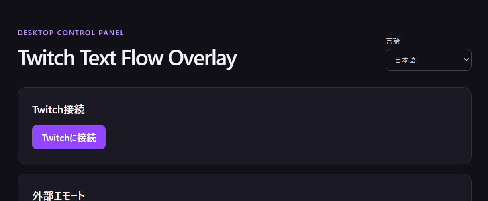
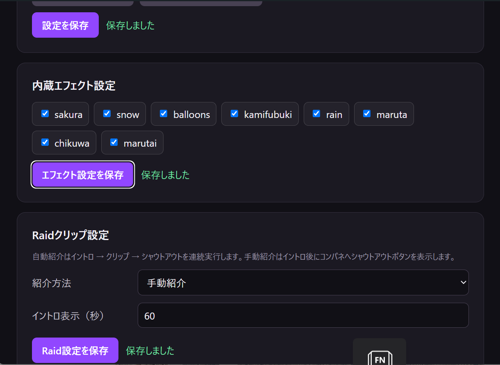
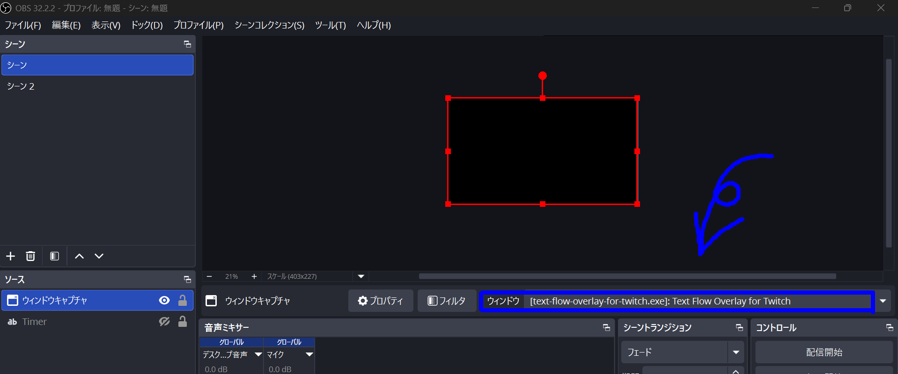
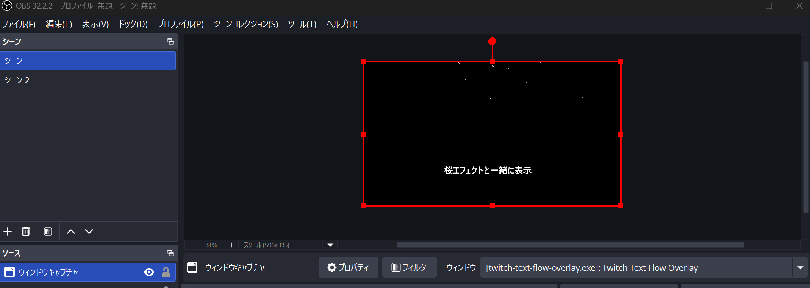
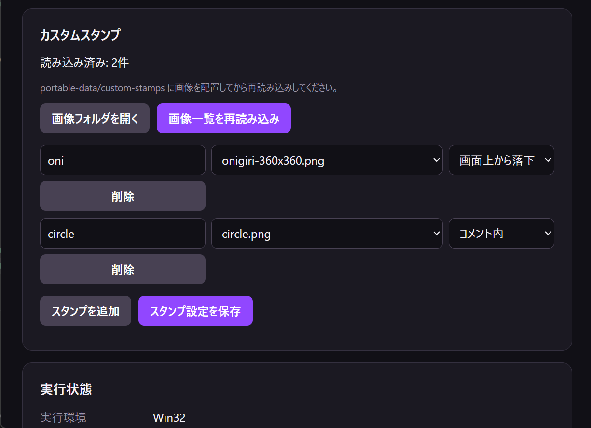
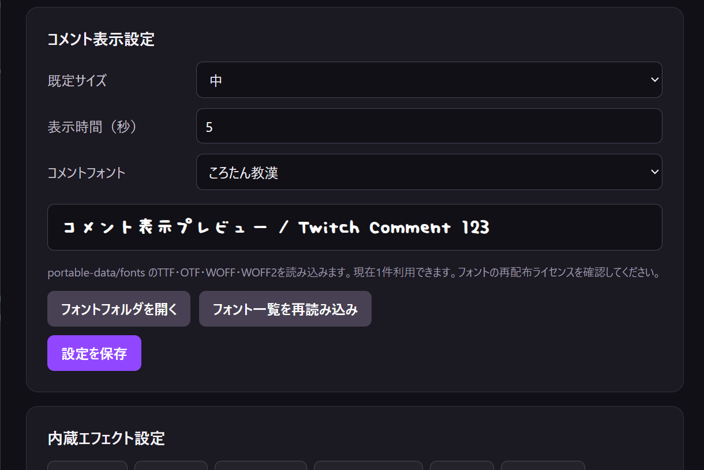

# Twitch Text Flow Overlay

[日本語](README.md) | [English](README.en.md)

Twitchチャットのコメント、エモート、カスタムスタンプ、エフェクト、Raid紹介をOBSへ表示するWindows向けデスクトップアプリです。

Streamer.botやインストーラーは必要ありません。ZIPを展開してEXEを起動し、Twitchへ接続すると使用できます。



## できること

- Twitchコメントとエモートを画面上へ流す
- BTTV・7TVのエモートを表示する
- 桜、雪、風船、紙吹雪などのエフェクトを表示する
- 好きな画像をカスタムスタンプとして登録する
- 標準フォントや追加したフォントへ変更する
- Raidしてくれた配信者の名前、画像、クリップを紹介する
- 自動紹介と、レイダーごとにクリップ・シャウトアウトを選べる手動紹介を切り替える
- Raidしてくれた配信者をシャウトアウトする
- コメント、Bits、サブスク、ギフト、Raidへ反応したユーザーを記録する
- 日本語と英語を切り替える
- OBSでのキャプチャを維持したままオーバーレイを画面外へ移動する
- 設定や画像をEXEと一緒に持ち運ぶ

一度Twitchへ接続するとログイン情報が保存され、通常は次回起動時も接続が継続されます。

## 動作環境

- Windows 10またはWindows 11（x64）
- Microsoft Edge WebView2 Runtime
- Twitchアカウント
- OBS Studio（配信へ取り込む場合）

Windows 10・11の多くの環境にはWebView2 Runtimeが導入済みです。アプリが起動しない場合は、Microsoftが提供するWebView2 Runtimeを導入してください。

## ポータブル版の使い方

1. GitHub Releasesから`Twitch-Text-Flow-Overlay-*-windows-portable.zip`をダウンロードする
2. ZIPを任意の書き込み可能なフォルダへ展開する
3. `Twitch Text Flow Overlay.exe`を実行する
4. コンパネの「Twitchに接続」から認証する
5. コメント、エフェクト、Raidなどを設定して保存する
6. OBSへオーバーレイウィンドウを追加する



初回起動時にEXEと同じ場所へ`portable-data`が作成されます。更新時は`portable-data`を残し、EXEを新しいバージョンへ差し替えてください。

アプリは多重起動されません。起動済みの状態でもう一度EXEを実行すると、新しいプロセスは終了し、既存のコンパネが前面へ表示されます。

## OBSへの追加

1. OBSのソースで「ウィンドウキャプチャ」を追加する
2. ウィンドウから`Twitch Text Flow Overlay`を選択する
3. 必要に応じて変換やクロップでサイズを調整する
4. コンパネのオーバーレイテストでコメントやRaidイントロを確認する
5. 配信時はコンパネの「画面外へ移動」を使用する



画面外への移動はウィンドウを閉じず、座標だけをデスクトップ外へ変更します。そのため、OBSは同じウィンドウを継続してキャプチャできます。

Twitchクリップは安定した自動再生のため常にミュートです。

## Raid紹介

Raid紹介では、イントロ時間、クリップ再生、本数、シャウトアウトの使用有無を共通設定できます。

- 自動紹介では、イントロ → クリップ → シャウトアウトを設定に従って順番に実行します
- 手動紹介では、イントロ後にレイダーごとの操作カードをコンパネへ表示します
- 手動カードでは、クリップ再生とシャウトアウトを好きな順序で実行できます
- 有効な操作がすべて完了するとカードは自動で閉じます
- 操作を省略する場合は、カード右上の`×`で閉じられます

Twitchの制限に合わせ、シャウトアウトは全体で2分間隔、同じ相手には60分間隔で管理されます。手動カードでは待機中の残り秒数を表示し、制限中のAPI呼び出しを防ぎます。

詳しい動作は[Raid紹介](docs/raid-intro.md)を参照してください。

## コメントコマンド

コメントの先頭にコマンドを書くと、文字の大きさ、色、位置、エフェクトを指定できます。複数の種類を半角スペースで区切って組み合わせられます。コマンド部分はオーバーレイには表示されません。

```text
big pink naka 中央に大きなピンク色で表示
small blue migi 右側に小さな青色で表示
sakura medium 桜エフェクトと一緒に表示
```



コマンドはコメントの先頭から記述してください。最初に通常の文章があると、それ以降はコマンドとして解釈されません。サイズ・色・エフェクトは1コメントにつき各1種類を指定でき、標準コマンドの英字は大文字と小文字を区別しません。

### 文字サイズ

| コマンド | 表示 |
| --- | --- |
| `small` | 小 |
| `medium` | 中 |
| `big` | 大 |

サイズを指定しない場合は、コンパネで選択した既定サイズを使用します。

### 基本色

| コマンド | 色 |
| --- | --- |
| `white` | 白 |
| `red` | 赤 |
| `orange` | オレンジ |
| `blue` | 青 |
| `green` | 緑 |
| `yellow` | 黄 |
| `pink` | ピンク |
| `cyan` | シアン |
| `purple` | 紫 |
| `black` | 黒 |

### 追加色と別名

| コマンド | 同じ色になる別名 |
| --- | --- |
| `white2` | `niconicowhite` |
| `red2` | `truered` |
| `pink2` | なし |
| `orange2` | `passionorange` |
| `yellow2` | `madyellow` |
| `cyan2` | なし |
| `blue2` | `marineblue` |
| `purple2` | `nobleviolet` |
| `black2` | なし |
| `green2` | `elementalgreen` |

### 表示位置

| コマンド | 表示位置 |
| --- | --- |
| 指定なし | 右から左へ流れる |
| `ue` | 上中央 |
| `naka` | 中央 |
| `shita` | 下中央 |
| `migi` | 右中央 |
| `hidari` | 左中央 |
| `migiue` | 右上 |
| `migishita` | 右下 |
| `hidariue` | 左上 |
| `hidarishita` | 左下 |

位置を指定したコメントは画面上を流れず、その位置へ一定時間表示されます。

### エフェクト

| コマンド | エフェクト |
| --- | --- |
| `sakura` | 桜 |
| `snow` | 雪 |
| `balloons` | 風船 |
| `kamifubuki` | 紙吹雪 |
| `rain` | 雨 |
| `maruta` | 丸太 |
| `chikuwa` | ちくわ |
| `marutai` | マルタイ |

コンパネで無効にしているエフェクトは表示されません。

### 改行とヘルプ

- コメント内へ文字列`U+2003`を入れると、その位置で改行します
- `!helpcs`だけを投稿すると、登録済みカスタムスタンプのコマンドを左下へ順番に表示します

```text
big pink 1行目 U+2003 2行目
```

## カスタムスタンプ

コンパネの「画像フォルダを開く」から`portable-data/custom-stamps`を開き、PNG、JPEG、GIF、WebPを配置します。画像を再読み込みした後、コマンド名、画像、表示方式を設定して保存してください。



詳細は[カスタムスタンプ](docs/custom-stamps.md)を参照してください。

## カスタムフォント

コンパネの「フォントフォルダを開く」から`portable-data/fonts`を開き、TTF、OTF、WOFF、WOFF2を配置します。「フォント一覧を再読み込み」を押すと、標準フォントと同じドロップダウンの「カスタムフォント」へ追加されます。



フォントをアプリと一緒に配布する場合は、各フォントの再配布ライセンスを確認してください。詳細は[カスタムフォント](docs/custom-fonts.md)を参照してください。

## データ保存場所

```text
portable-data/
├─ auth/           Twitchログイン情報
├─ config/         オーバーレイ設定
├─ custom-stamps/  カスタムスタンプ画像と設定
├─ fonts/          カスタムフォント
└─ audience/       反応ユーザー記録
```

`portable-data/auth`にはTwitchへ接続するための重要な情報が含まれます。認証済みの`portable-data`をGitHub Releasesや第三者へ配布しないでください。

別のPCへ移行する場合は、EXEだけではなくアプリのフォルダ全体をコピーしてください。

## 開発者向け情報

### 技術スタック

- Tauri 2
- Rust
- React 19
- TypeScript
- Vite
- Microsoft Edge WebView2
- i18next
- Biome
- Twitch OAuth Device Code Flow
- Twitch Helix API
- Twitch EventSub WebSocket

Twitchのアクセストークンとrefresh tokenは`portable-data/auth/twitch-token.json`へ保存します。起動時と起動中にトークンを検証し、必要に応じて更新してからTwitch接続を継続します。

認証処理の詳細は[Twitchログインの継続](docs/twitch-token-refresh.md)を参照してください。

### 開発環境

開発には次の環境が必要です。

- Node.jsとnpm
- Rust stableとCargo
- Microsoft C++ Build Tools
- Microsoft Edge WebView2 Runtime

依存関係をインストールします。

```powershell
npm install
```

Tauri開発版を起動します。

```powershell
npm run dev:tauri
```

`cargo metadata: program not found`と表示される場合はRustを導入し、新しいターミナルで`cargo --version`が成功することを確認してください。

### 開発用コマンド

| コマンド | 内容 |
| --- | --- |
| `npm run dev:tauri` | Tauri開発版を起動 |
| `npm run build` | TypeScriptとrendererをビルド |
| `npm run typecheck` | TypeScript型チェック |
| `npm run check` | Biomeチェック |
| `npm run tauri:build` | Tauriリリースビルド |
| `npm run tauri:portable` | Windowsポータブル版とRelease用ZIPを作成 |

### ポータブル版のビルド

```powershell
npm run tauri:portable
```

生成物は次の場所へ出力されます。

```text
release/portable/Twitch Text Flow Overlay/
release/Twitch-Text-Flow-Overlay-v<version>-windows-portable.zip
```

GitHub ReleasesにはEXE単体ではなく、生成されたZIPを登録してください。詳細は[Windowsポータブル版](docs/portable-build.md)を参照してください。

## 関連ドキュメント

- [Raid紹介](docs/raid-intro.md)
- [Twitchログインの継続](docs/twitch-token-refresh.md)
- [カスタムスタンプ](docs/custom-stamps.md)
- [カスタムフォント](docs/custom-fonts.md)
- [Windowsポータブル版](docs/portable-build.md)

## ライセンス

このプロジェクトの`package.json`ではMITライセンスを指定しています。使用するカスタム画像やフォントには、それぞれのライセンスが適用されます。
